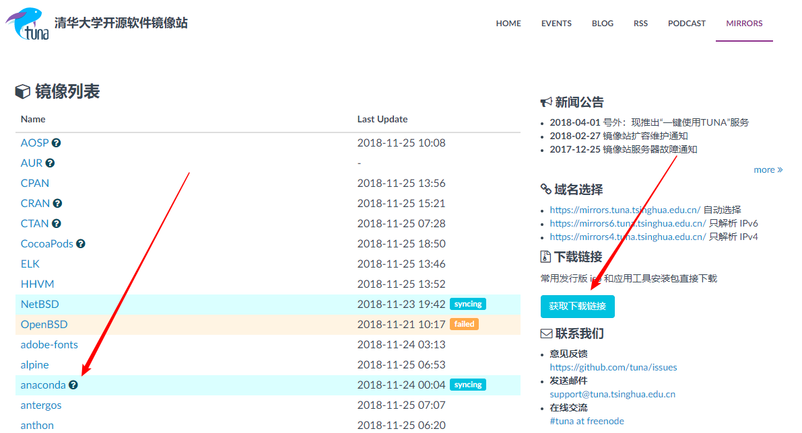
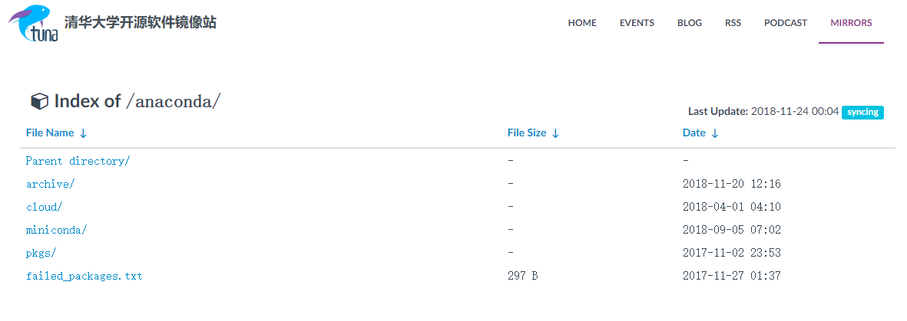
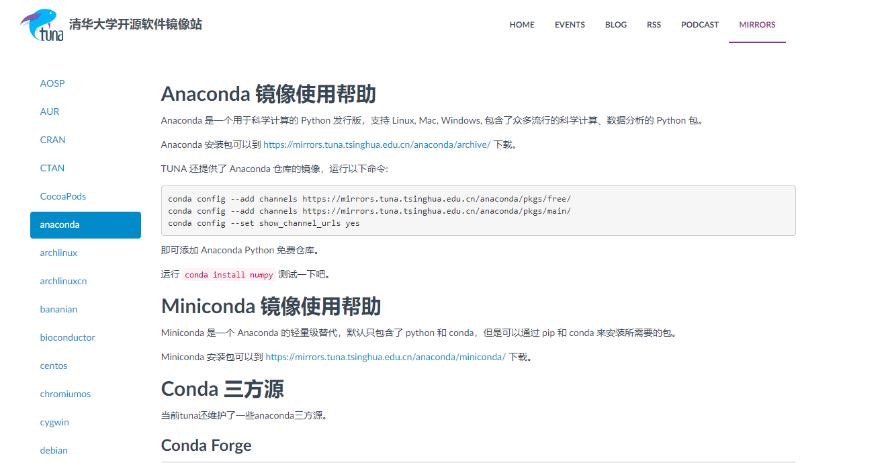
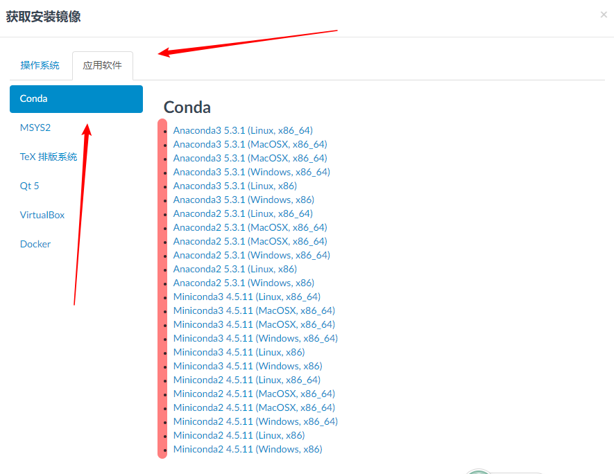

# Python的安装

## Anaconda科学计算平台

[Anaconda](https://www.anaconda.com/)是一个科学计算包，同时也是一个开源的Python发行版，包含了一个Python二进制分发包、很多Python科学计算类库（总计超过720个开源类库）、以及一个方便的包管理器工具来下载其他类库。如果你需要使用Python进行科研工作，一劳永逸地下载Anaconda是一个不错的办法。

用最简单的话说就是，你安装了Anaconda就相当于安装了Python，同时也能非常方便的安装各种Python强大的类库。

其他详细信息我们可以参考[百度百科](https://baike.baidu.com/link?url=FlgEEoyW4rAnnFJc5Ze3xCR_9ZtQLH46RWMOs9NoF8yyqkWx6rt30xIVWTyx8wZQVtm3Cfhure4eqSCl4PPNHvMrUG-rcEiU9k93uyswJ_u).

## Anaconda 软件的特点

- 开源
- 安装简单方便
- 高性能的使用Python和R语言
- 免费的开源社区支持

> Anaconda拥有1000+的开源库，如果日常工作或学习其实并不比使用那么多，可以考虑安装Miniconda（相当于简化版本，仅包含必须的类库，其他的使用时在进行安装），Miniconda拥有所有Anaconda的特性，只不过类库相对较少；下面的安装过程同样适用于miniconda的安装。

## Anaconda的适用平台及安装要求

### 适用平台

- Windows
- Linux
- Mac OS

### 安装要求

- 系统要求：32位或64位系统均可（未来版本可能会仅提供64位）
- 下载文件大小：约500MB
- 所需空间大小：3GB空间大小（Miniconda仅需400MB空间即可）

### 写在安装之前

由于Anaconda是国外服务器，下载安装包比较慢，并且在后期使用时，也由于网络的限制可能会有中断的可能。

> 当然如果你的网络环境非常流畅请忽略，但是也希望通过下面的方式进行安装和使用！

为了杜绝上述麻烦，[清华大学开源镜像站](https://mirrors.tuna.tsinghua.edu.cn/)已经将Anaconda的安装文件和各种类库实时更新，我们仅需要简单配置即可方便的使用。当然还有其他的镜像站可以使用，例如[中科大镜像]()等。

除此之外，有时我们也需要利用pip进行安装，同样的道理使用国内镜像提高我们的安装体验，推荐使用[豆瓣源](https://pypi.douban.com/simple/)。也存在许多其他源，例如清华镜像、中科大镜像等，不过笔者多使用豆瓣源，因此推荐给大家使用。

## 清华开源镜像站使用指南

如上图所示，需要我们注意两个可能用到的地方：

1. 左侧箭头指示包含了anaconda的所有文件路径以及镜像设置帮助
2. 右侧提供了anaconda或miniconda的最新版本下载。

上图为点击anaconda文件树后显示的页面，内容分别如下：

1. archive：所有的anaconda安装文件
2. cloud：部分云库
3. miniconda：所有的miniconda安装文件
4. pkgs：所有的类库

上图展示了使用帮助，我们只需要在Anaconda安装完成后，打开CMD或powershell(windows)，terinmal(Mac or Linux)安装命令依次输入即可。

除了常用的conda forge镜像还包括了其他一些常用的类库，例如pytorch等。如果对其他第三方源有需求，可以到issue总提出请求。

上图展示了获取镜像的页面，我们选择应用软件，再选择Conda，依次列出了所有下载链接。当然这里包含了最新版本，如果需要历史版本则需要去所有安装文件的目录下获取链接地址并下载使用了。

> 无论哪种平台安装都是无比的傻瓜式，我们需要做的就是等待....

## Windows

按照清华开源镜像的使用指南，我们下载Anaconda3 5.4.1，这里请根据你的机器信息进行下载，至于机器信息如何获取请按照获取帮助一节自行查询。

下面依次将anaconda安装的几个步骤分别截图展示即可。

## Linux

>  为简便行事，笔者这里采用windows10下的WSL系统进行linux环境的安装搭建；

下面依次将anaconda安装的几个步骤分别截图展示即可

## [Mac OS][^Raxxie]

1. 完成下载之后，双击下载文件，在对话框中“Introduction”、“Read Me”、“License”部分可直接点击下一步。
2. “Destination Select”部分选择“Install for me only”并点击下一步。

> 注意：若有错误提示信息“You cannot install Anaconda in this location”则重新选择“Install for me only”并点击下一步。

1. “Installation Type”部分，可以点击“Change Install Location”来改变安装位置。标准的安装路径是在用户的家目录下。在这一步我没有改变安装位置。若选择默认安装路径，则直接点击“Install”进行安装。

   

2. 等待“Installation”部分结束，在“Summary”部分若看到“The installation was completed successfully.”则安装成功，直接点击“Close”关闭对话框。

   

3. 在mac的Launchpad中可以找到名为“Anaconda-Navigator”的图标，点击打开。

   

4. 若“Anaconda-Navigator”成功启动，则说明真正成功地安装了Anaconda；如果未成功，请务必仔细检查以上安装步骤。

> “Anaconda-Navigator”中已经包含“Jupyter Notebook”、“Jupyterlab”、“Qtconsole”和“Spyder”。（图中的“Rstudio”是我后来安装的，但它默认出现在“Anaconda-Navigator”的启动界面，只需要点击“Install”便可安装。）

5. 完成安装。

#### 命令行安装

1. 同样下载安装软件。
2. 完成下载之后，在mac的Launchpad中找到“其他”并打开“终端”。
   - 安装Python 3.6：`bash ~/Downloads/Anaconda3-5.0.1-MacOSX-x86_64.sh` 

> 注意： 
>
> - 首词bash也需要输入，无论是否用的Bash shell。
>
> - 如果你的下载路径是自定义的，那么把该步骤路径中的`~/Downloads`替换成你自己的下载路径。
>
> - 如果你将第1步下载的`.sh`文件重命名了，那么把该步骤路径中的`Anaconda3-5.0.1-MacOSX-x86_64.sh`或`Anaconda2-5.0.1-MacOSX-x86_64.sh`替换成你重命名后的文件名。

> *强烈建议：**不要**修改文件名。如果重命名，使用**英文进行命名。*

3. 安装过程中，看到提示“In order to continue the installation process, please review the license agreement.”（“请浏览许可证协议以便继续安装。”），点击“Enter”查看“许可证协议”。

4. 在“许可证协议”界面将屏幕滚动至底，输入“yes”表示同意许可证协议内容。然后进行下一步。

5. 安装过程中，提示“Press Enter to confirm the location, Press CTRL-C to cancel the installation or specify an alternate installation directory.”（“按回车键确认安装路径，按'CTRL-C'取消安装或者指定安装目录。”）如果接受默认安装路径，则会显示“PREFIX=/home/<user>/anaconda<2 or 3>”并且继续安装。安装过程大约需要几分钟的时间。

> 建议：直接接受默认安装路径。

6. 安装器若提示“Do you wish the installer to prepend the Anaconda install location to PATH in your /home/<user>/.bash_profile ?”（“你希望安装器添加Anaconda安装路径在`/home/<user>/.bash_profile`文件中吗？”），建议输入“yes”。

> 注意：
>
> - 路径`/home/<user>/.bash_profile`中“<user>”即进入到家目录后你的目录名。
>
> - 如果输入“no”，则需要手动添加路径。添加`export PATH="/<path to anaconda>/bin:$PATH"`在“.bashrc”或者“.bash_profile”中。其中，“<path to anaconda>”替换为你真实的Anaconda安装路径。
>
>  

7. 当看到“Thank you for installing Anaconda!”则说明已经成功完成安装。

8. 关闭终端，然后再打开终端以使安装后的Anaconda启动。

9. 验证安装结果。可选用以下任意一种方法：

10. 在终端中输入命令`condal list`，如果Anaconda被成功安装，则会显示已经安装的包名和版本号。
     

### 安装成功

当我们完成上述步骤之后就意味着我们安装成功，可以开始愉快的Python之旅的。但在这之前我们还是要对之前的步骤做一下验证。

1. 首先打开终端输入Python，则显示如下界面则成功，否则我们还需要重零开始；进入命令行后，退出时我们需要输入`quit()`或者`exit()`并回车。

   

2. IPython：当然我们还可以输入IPython用于检查Anaconda的安装，如果安装的是Miniconda则不能通过这种方式来进行验证，因其根本就没有安装IPython的类库。

   

3. 其次输入conda info

## Conda简明使用教程

介绍完安装流程，下面我们来简要介绍一些如何高效的使用conda命令行，也就是Anaconda最核心的功能：包管理。

### conda 环境信息

`conda info`

正如看到的输入conda info之后会列出当前我们安装的conda环境，例如配置文件的位置:`c:\Users\Administrator\.condarc`，conda的版本号、python的版本号、基础环境位置、安装渠道、包缓存位置等信息，同时也提供相应的命令个别参数进行修改。

> 我们也可以打开配置文件直接进行修改！
>
> 所谓基础环境位置是相对于虚拟环境而言的，当使用虚拟环境时，所得到的conda info 与上述信息会有所不同，这在虚拟环境一节中会有详细介绍。

### 安装类库

`conda install *pkgname*`

举例来说，如果想安装numpy、scipy、matplotlib科学计算三件套的话，只需要一次性输入一条命令如下即可安装：`conda install numpy scipy matplotlib` 

> conda会自动根据当前的安装环境查找相应的包，此外有些时候我们需要固定版本的包，那么也可以直接给定包的具体版本号进行安装！

`conda install numpy ==1.4.1` 

这样我们就按照版本号进行安装了！

#### 更新类库（关键词`update`）

`conda update *pkgname*`  

#### 卸载类库（关键词`remove`）

`conda remove *pkgname*`

### 虚拟环境

`conda create -n *your env name* [python=3.6.5]`

> 虚拟环境的名称是必填项，Python的版本是选填项，当不选择版本是，则默认为anaconda提供的当前最新Python版本。

[^Raxxie]: https://www.jianshu.com/p/62f155eb6ac5	"本文部分引用来自简书"